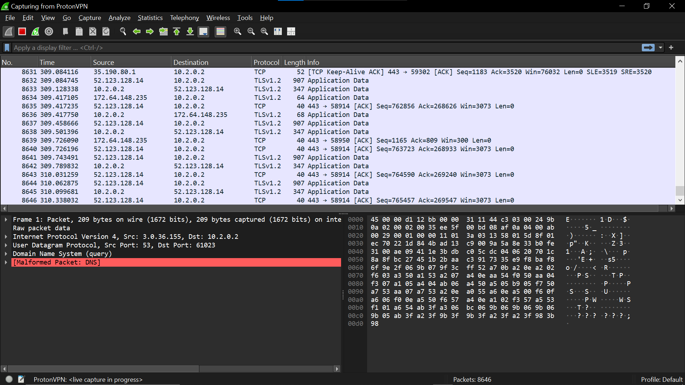

# vpn-traffic-analysis
Analysis of VPN encryption using Wireshark
## VPN Traffic Analysis Using Wireshark

### Objective
To observe how a VPN hides user activity from the network by encrypting traffic.

### Tools
Wireshark, Proton VPN

### Method
Network traffic was captured with VPN OFF and then with VPN ON while visiting google.com and youtube.com.

### Results

#### Without VPN
DNS queries and website IPs were visible, revealing which websites were accessed.

Screenshots/no_vpn.png

#### With VPN
All traffic was sent as encrypted TLS packets to a single VPN server. No DNS or website information was visible.

### Security Impact
VPN prevents ISPs and attackers on the same network from seeing browsing activity by encrypting all traffic inside a secure tunnel.
